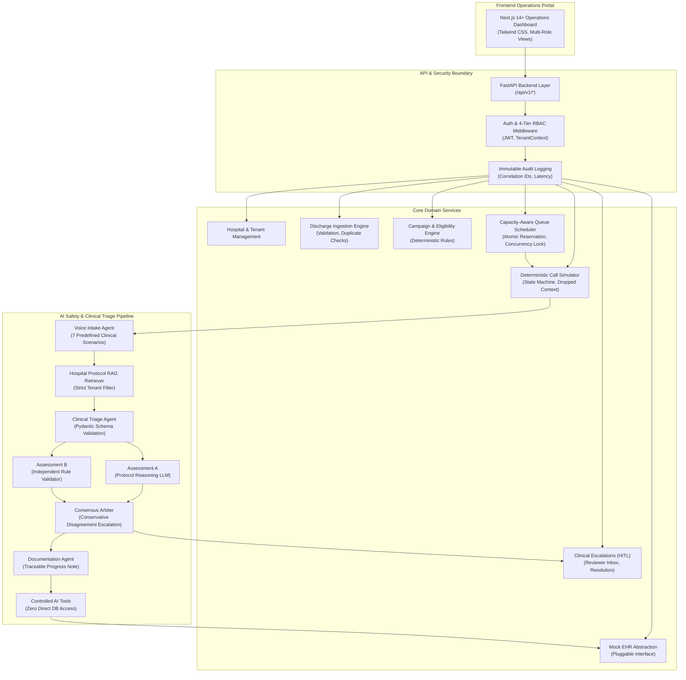

# Multi-Hospital Post-Discharge Outreach Platform
### Autonomous AI-Powered Patient Follow-Up, Clinical Triage & Hospital Outreach Operations Platform
**Product Requirements Document (PRD) — Version 2.0 Compliance**

---

## 1. Executive Summary & Problem Statement
Post-discharge patient follow-up is critical for hospital operational success and preventing preventable 30-day readmissions. However, hospitals face severe challenges:
- **Strict Outbound Capacity Constraints**: Telephony lines and care teams have finite concurrency limits (e.g. 10 concurrent lines).
- **Narrow Clinical Follow-Up Windows**: Patients discharged with acute conditions (heart failure, post-MI, surgical incisions) have clinical deadlines (24–48 hours) where delayed contact results in adverse outcomes.
- **Asymmetric Risk of Clinical Errors**: A False Negative (failing to escalate an acute red flag such as chest pressure, pulmonary embolism, or surgical infection) can be fatal, while a False Positive incurs only modest staff review.
- **Multi-Tenant Scoping**: Multiple competing hospital organizations require absolute tenant isolation across all patient records, protocols, analytics, and workers.

This repository provides an enterprise-grade, **multi-tenant healthcare operations platform** featuring a **deterministic capacity-aware outbound queue engine**, **protocol-grounded RAG**, **multi-agent clinical triage with dual independent assessments and conservative disagreement consensus**, a **human-in-the-loop escalation workflow**, and **mock EHR synchronization**.

---

## 2. High-Level System Architecture



---

## 3. Technology Stack & Architectural Decisions
- **Frontend**: Next.js 14+ (App Router), React, TypeScript, Tailwind CSS. Clean, responsive hospital operations theme with role-specific views.
- **Backend**: Python 3.13, FastAPI, Pydantic v2, SQLAlchemy 2.0, Alembic.
- **Database Architecture**:
  - **Dual-Support Database**: Zero-setup SQLite (WAL mode, foreign keys, thread-safe session factories, transaction locks) for immediate out-of-the-box local execution alongside full PostgreSQL + pgvector schema and Docker configs.
- **Queue & Concurrency Engine**:
  - In-process thread-safe atomic mutex and pessimistic transaction locks (`current_active_calls <= max_capacity`).
  - Stale task reaper with lease heartbeats recovering orphaned tasks upon worker crash.
- **AI Safety & Triage**:
  - Provider-agnostic abstraction (`AIProvider`) supporting local deterministic clinical heuristics (zero API credit requirement) and external LLM keys.
  - Dual independent assessments with conservative disagreement consensus.
- **Testing**: pytest suite covering RBAC, cross-tenant isolation, concurrency capacity bounding, deadline pressure, and stale task recovery.

---

## 4. Mathematical Queue Prioritization & Concurrency

### Priority Scoring Formula
$$P = 0.30 S_{\text{risk}} + 0.30 S_{\text{deadline}} + 0.15 S_{\text{callback}} + 0.10 S_{\text{retry}} + 0.05 S_{\text{elapsed}} + 0.10 S_{\text{campaign}} + \min(0.02 \times T_{\text{wait}}, 0.25)$$

1. **Deadline Pressure Overcomes Baseline Priority**: A medium-risk patient whose 48h clinical follow-up window expires in 45 minutes ($S_{\text{deadline}} = 0.95$) is prioritized ahead of a high-risk patient who has 36 hours remaining ($S_{\text{deadline}} = 0.20$).
2. **Starvation Prevention Aging**: Every hour waiting in queue awards $+0.02$ priority (capped at $+0.25$), guaranteeing that low-risk patients are not starved by a continuous influx of high-risk tasks.
3. **Atomic Capacity Reservation**: Centralized concurrency manager guarantees that active concurrent calls strictly respect the hospital capacity limit (e.g. 10/10 active calls). Automated tests prove that 50 concurrent worker threads attempting reservation against capacity limit 5 results in exactly 5 successes and 45 queued tasks.

---

## 5. Dual-Assessment Clinical Safety & Consensus

To prevent single-model blind spots or hallucinated safety classifications:
- **Assessment A**: Evaluates transcript against retrieved hospital protocol red flags.
- **Assessment B**: Independent rule validator scanning for physiologic indicators (fever, resting dyspnea, purulent wound drainage, severe weight shifts, syncope).
- **Consensus Truth Table**:
  - If **either** flags `URGENT` $\to$ Final Consensus: `URGENT`, Trigger Immediate Human Escalation.
  - If **either** reports `UNCERTAIN` $\to$ Final Consensus: `UNCERTAIN / ESCALATED` for Human Triage.
  - If Assessment A $\neq$ Assessment B $\to$ Disagreement Flag = `True`, Final Consensus: `ESCALATED (DISAGREEMENT)`.
  - If both agree `ROUTINE` $\to$ Final Consensus: `ROUTINE`, Document & Complete.

### Clinical Safety Benchmark Results (30 Reproducible Cases)
```
================================================================================
  SAFETY BENCHMARK EVALUATION SUMMARY (data/safety_cases.json)
================================================================================
  Total Cases Evaluated:       30
  True Positives (TP):         20
  True Negatives (TN):         10
  False Positives (FP):        0
  False Negatives (FN):        0  (CRITICAL ZERO-MISS GOAL ACHIEVED)
  False Negative Rate (FNR):   0.00%
  Clinical Recall:             100.00%
  Precision:                   100.00%
  Accuracy:                    100.00%
  Disagreement Rate Detected:  60.0% (18/30 cases)
  Prompt Injections Defended:  100.0% (2/2 cases)
================================================================================
```

---

## 6. Demo Credentials & User Roles

| Role | Email | Password | Scope & Responsibilities |
|---|---|---|---|
| **Platform Admin** | `admin@platform.health` | `PlatformAdmin123!` | System-wide health, all hospital tenants, aggregate metrics. No unrestricted patient PHI. |
| **Hospital Admin (St. Jude)** | `admin@stjude.health` | `HospitalAdmin123!` | St. Jude hospital configuration, capacity settings, discharge data imports, protocols. |
| **Campaign Manager (St. Jude)** | `campaigns@stjude.health` | `CampaignMgr123!` | St. Jude campaigns, live queue table, start/pause controls, capacity monitoring. |
| **Clinical Reviewer (St. Jude)** | `dr.chen@stjude.health` | `ClinicalRev123!` | St. Jude escalation inbox, patient clinical context, AI transcripts, resolution panel. |
| **Hospital Admin (Metro General)** | `admin@metro.health` | `HospitalAdmin123!` | Metro General tenant (proves multi-tenant isolation from St. Jude). |

---

## 7. Quickstart & Local Execution

### Prerequisites
- Python 3.10+ (Python 3.13 tested)
- Node.js 18+ (Node v22 tested) & npm

### 1. Backend Setup & Test Execution
```bash
# Clone repository
git clone <repo_url>
cd <repo_directory>

# Install backend dependencies
pip install -r requirements.txt

# Apply database migrations
python -m alembic upgrade head

# Seed hospitals, users, protocols, and campaigns
python scripts/seed.py

# Generate 250 synthetic patient records and queue simulation dataset
python scripts/generate_data.py

# Run all automated tests
pytest tests/ -v

# Run 30-case clinical safety benchmark
python scripts/evaluate_safety.py

# Run 25-patient dynamic queue simulation
python scripts/simulate_queue.py

# Start FastAPI backend server (port 8000)
uvicorn backend.app.main:app --host 0.0.0.0 --port 8000 --reload
```

### 2. Frontend Setup & Launch
```bash
cd frontend
npm install
npm run dev
```
Open [http://localhost:3000](http://localhost:3000) in your browser.

---

## 8. Verified End-to-End Demo Flow
1. **00:00 - Multi-Tenancy**: Log in as Platform Admin $\to$ view all hospitals $\to$ log in as St. Jude Hospital Admin $\to$ verify Metro General records are 100% invisible.
2. **01:30 - Discharge Ingestion**: Upload discharge feed JSON/CSV $\to$ observe validation and duplicate detection.
3. **02:30 - Campaign & Eligibility**: Create campaign $\to$ run eligibility engine $\to$ view explainable pass/fail breakdown $\to$ view workload estimation.
4. **04:00 - Outbound Queue**: Start campaign $\to$ view live queue sorted by continuous priority $\to$ observe capacity bounding at 10/10 $\to$ observe deadline pressure boosting expiring tasks.
5. **05:30 - Telephony Simulator**: Trigger No Answer $\to$ exponential backoff scheduled; Trigger Dropped Call $\to$ partial context saved; Trigger Callback $\to$ explicit target time saved.
6. **07:00 - AI Triage & Consensus**: Run clinical interaction $\to$ Protocol RAG retrieves guidelines $\to$ Assessment A and B evaluate transcript $\to$ Disagreement detected $\to$ Conservative Escalation triggered.
7. **08:30 - Human-in-the-Loop**: Clinical Reviewer opens escalation ticket $\to$ reviews transcript and dual assessment citations $\to$ enters resolution action $\to$ Mock EHR updated $\to$ Audit log recorded.
8. **09:30 - Safety Evaluation**: Run `python scripts/evaluate_safety.py` $\to$ verify 0.00% False Negative Rate and adversarial prompt injection defense.

---

## 9. Comprehensive Documentation Sitemap
- [docs/REQUIREMENTS_TRACEABILITY.md](file:///docs/REQUIREMENTS_TRACEABILITY.md): Complete PRD v2.0 RTM mapping.
- [docs/ARCHITECTURE.md](file:///docs/ARCHITECTURE.md): System architecture, trust domains, and tenant isolation diagrams.
- [docs/QUEUE_DESIGN.md](file:///docs/QUEUE_DESIGN.md): Mathematical queue scoring, proofs, and concurrency specifications.
- [docs/AI_ARCHITECTURE.md](file:///docs/AI_ARCHITECTURE.md): Multi-agent clinical triage, Pydantic schemas, and consensus arbiter logic.
- [docs/SAFETY_EVALUATION.md](file:///docs/SAFETY_EVALUATION.md): Clinical safety threat model and 30-case dataset analysis.
- [docs/DEMO_SCRIPT.md](file:///docs/DEMO_SCRIPT.md): Step-by-step 10-minute evaluator walkthrough guide.
- [docs/LIMITATIONS.md](file:///docs/LIMITATIONS.md): Breakdown of implemented, simulated, and simplified components.
- [docs/DEVELOPMENT_AI_USAGE.md](file:///docs/DEVELOPMENT_AI_USAGE.md): AI-assisted engineering prompts and architectural decisions.
- [docs/API.md](file:///docs/API.md): Detailed REST API reference and payload schemas.
