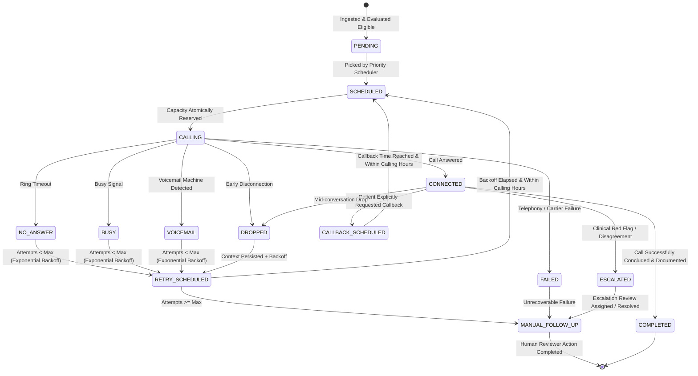

# Outbound Queue & Concurrency Design Specification

## Multi-Hospital Post-Discharge Outreach Platform (PRD v2.0)

### 1. Problem Statement
Post-discharge outreach platforms must operate under strict operational constraints:
- **Strict Capacity Limits**: Hospitals have limited telephony lines/agent capacity (e.g. 10 concurrent calls). Multiple worker nodes competing for outreach tasks must never exceed this capacity limit.
- **Narrow Clinical Follow-Up Windows**: Patients are discharged with deadlines (e.g., call required within 24–48 hours to prevent readmission).
- **Heterogeneous Patient Risk**: Patients range from Low risk (minor elective procedure) to Urgent risk (heart failure exacerbation, post-MI, multiple comorbidities).
- **Competing Campaigns & Starvation**: Multiple active campaigns compete for the same hospital capacity. High-volume campaigns must not starve smaller urgent campaigns, and high-risk patients must not permanently starve low-risk patients.
- **Dynamic Call Outcomes**: No-answers, busy lines, voicemail drops, mid-call disconnections, and patient callback requests require structured retries and backoff without flooding patients.

---

### 2. Task Lifecycle & State Machine



#### Valid State Transitions
| Source State | Allowed Destination States | Operational Trigger |
|---|---|---|
| `PENDING` | `SCHEDULED`, `FAILED` | Scheduler selects task based on score; or eligibility invalidated. |
| `SCHEDULED` | `CALLING`, `PENDING` | Worker reserves capacity and dials; or reservation aborted. |
| `CALLING` | `CONNECTED`, `NO_ANSWER`, `BUSY`, `VOICEMAIL`, `DROPPED`, `FAILED` | Telephony simulator event returned. |
| `CONNECTED` | `COMPLETED`, `CALLBACK_SCHEDULED`, `ESCALATED`, `DROPPED` | Outcome determined by patient response / clinical triage. |
| `NO_ANSWER` | `RETRY_SCHEDULED`, `MANUAL_FOLLOW_UP` | Under max attempts: backoff; else manual follow-up. |
| `BUSY` | `RETRY_SCHEDULED`, `MANUAL_FOLLOW_UP` | Under max attempts: backoff; else manual follow-up. |
| `VOICEMAIL` | `RETRY_SCHEDULED`, `MANUAL_FOLLOW_UP` | Under max attempts: backoff; else manual follow-up. |
| `DROPPED` | `RETRY_SCHEDULED`, `MANUAL_FOLLOW_UP` | Partial context saved, backoff computed. |
| `RETRY_SCHEDULED` | `SCHEDULED`, `MANUAL_FOLLOW_UP` | Backoff elapsed and calling window open. |
| `CALLBACK_SCHEDULED` | `SCHEDULED`, `MANUAL_FOLLOW_UP` | Callback time arrived and calling window open. |
| `ESCALATED` | `MANUAL_FOLLOW_UP`, `RESOLVED` | Clinical reviewer assigned or immediate review initiated. |
| `MANUAL_FOLLOW_UP` | `RESOLVED`, `CLOSED` | Clinical staff resolves outreach case. |

---

### 3. Multi-Factor Priority Scoring Algorithm

The scheduler computes a continuous score $P \in [0.0, 1.0]$ for every eligible candidate task:

$$P = w_r S_{\text{risk}} + w_d S_{\text{deadline}} + w_c S_{\text{callback}} + w_{\text{retry}} S_{\text{retry}} + w_{\text{elapsed}} S_{\text{elapsed}} + w_{\text{camp}} S_{\text{campaign}} + \min(\alpha \cdot T_{\text{wait}}, 0.25)$$

#### Weight Distribution
- $w_r = 0.30$ (Clinical Risk)
- $w_d = 0.30$ (Clinical Deadline Urgency)
- $w_c = 0.15$ (Callback Urgency)
- $w_{\text{retry}} = 0.10$ (Retry Urgency)
- $w_{\text{elapsed}} = 0.05$ (Time Since Discharge)
- $w_{\text{camp}} = 0.10$ (Campaign Baseline Priority)
- $\alpha = 0.02 / \text{hour}$ (Starvation aging factor, capped at $+0.25$)

#### Component Formulations
1. **Clinical Risk ($S_{\text{risk}}$)**:
   $$\text{URGENT} \to 1.0, \quad \text{HIGH} \to 0.80, \quad \text{MEDIUM} \to 0.50, \quad \text{LOW} \to 0.25$$
2. **Deadline Pressure ($S_{\text{deadline}}$)**:
   Let $t_{\text{remaining}}$ be the hours remaining until the clinical follow-up deadline:
   $$S_{\text{deadline}} = \begin{cases} 
   1.0 & \text{if } t_{\text{remaining}} \le 0 \quad \text{(Expired / Critical Cutoff)} \\
   0.95 & \text{if } 0 < t_{\text{remaining}} \le 2 \\
   0.80 & \text{if } 2 < t_{\text{remaining}} \le 6 \\
   0.60 & \text{if } 6 < t_{\text{remaining}} \le 12 \\
   0.40 & \text{if } 12 < t_{\text{remaining}} \le 24 \\
   0.20 & \text{if } t_{\text{remaining}} > 24 
   \end{cases}$$
3. **Callback Urgency ($S_{\text{callback}}$)**:
   $$S_{\text{callback}} = \begin{cases} 
   1.0 & \text{if task is CALLBACK\_SCHEDULED and } t_{\text{now}} \ge t_{\text{callback}} \\
   0.85 & \text{if } 0 \le t_{\text{callback}} - t_{\text{now}} \le 30 \text{ min} \\
   0.0 & \text{otherwise}
   \end{cases}$$
4. **Retry Urgency ($S_{\text{retry}}$)**:
   For tasks in `RETRY_SCHEDULED` whose backoff has matured:
   $$S_{\text{retry}} = \min(1.0, 0.35 \times \text{attempt})$$
5. **Time Since Discharge ($S_{\text{elapsed}}$)**:
   $$S_{\text{elapsed}} = \min\left(1.0, \frac{t_{\text{now}} - t_{\text{discharge}}}{T_{\text{campaign\_window}}}\right)$$
6. **Campaign Priority ($S_{\text{campaign}}$)**:
   Normalized campaign baseline tier: $[0.1, 1.0]$.

---

### 4. Mathematical Comparison Examples

#### Example 1: Deadline Pressure Overcomes Baseline Priority
- **Patient A**: High Risk ($S_{\text{risk}} = 0.80$), Campaign Priority ($S_{\text{campaign}} = 0.80$), 36 hours remaining before deadline ($S_{\text{deadline}} = 0.20$). Wait time = 0.5h.
  $$P_A = 0.30(0.80) + 0.30(0.20) + 0.15(0) + 0.10(0) + 0.05(0.10) + 0.10(0.80) + 0.01 = 0.24 + 0.06 + 0 + 0 + 0.005 + 0.08 + 0.01 = \mathbf{0.395}$$
- **Patient B**: Medium Risk ($S_{\text{risk}} = 0.50$), Campaign Priority ($S_{\text{campaign}} = 0.50$), 45 minutes remaining before cutoff ($S_{\text{deadline}} = 0.95$). Wait time = 1.0h.
  $$P_B = 0.30(0.50) + 0.30(0.95) + 0.15(0) + 0.10(0) + 0.05(0.80) + 0.10(0.50) + 0.02 = 0.15 + 0.285 + 0 + 0 + 0.04 + 0.05 + 0.02 = \mathbf{0.545}$$
- **Decision**: Patient B is scheduled **BEFORE** Patient A ($0.545 > 0.395$) because failing to contact Patient B within 45 minutes violates the clinical follow-up protocol.

#### Example 2: Starvation Prevention (Aging Boost)
- **Patient C**: Low Risk ($S_{\text{risk}} = 0.25$, $S_{\text{deadline}} = 0.20$, $S_{\text{camp}} = 0.30$), but waiting in queue for 10 hours.
  $$\text{Base Score} = 0.30(0.25) + 0.30(0.20) + 0.05(0.2) + 0.10(0.3) = 0.075 + 0.06 + 0.01 + 0.03 = 0.175$$
  $$\text{Aging Boost} = \min(0.02 \times 10, 0.25) = 0.20 \implies P_C = 0.175 + 0.20 = \mathbf{0.375}$$
  Patient C moves ahead of newly arriving low-risk patients, guaranteeing bounded wait times.

---

### 5. Atomic Concurrency Control & Capacity Reservation

#### The Concurrency Invariant
$$\sum \text{Active Calls for Hospital } H \le \text{Capacity}(H) \quad \forall t$$

#### Atomic Reservation Algorithm
To prevent race conditions across parallel worker threads/processes:
```sql
-- Step 1: In an isolated transaction, lock and inspect current capacity
BEGIN;
SELECT current_active_calls, max_capacity 
FROM hospital_capacities 
WHERE hospital_id = :h_id 
FOR UPDATE;

-- Step 2: Validate available capacity
IF current_active_calls >= max_capacity THEN
    ROLLBACK;
    RETURN CAPACITY_EXHAUSTED;
END IF;

-- Step 3: Atomically select and lock the highest priority candidate task
SELECT id 
FROM outreach_tasks 
WHERE hospital_id = :h_id 
  AND status IN ('PENDING', 'RETRY_SCHEDULED', 'CALLBACK_SCHEDULED')
  AND (scheduled_for IS NULL OR scheduled_for <= NOW())
ORDER BY computed_priority DESC 
LIMIT 1 
FOR UPDATE SKIP LOCKED;

-- Step 4: Transition task state and increment active calls
UPDATE outreach_tasks 
SET status = 'CALLING', worker_id = :worker_id, call_started_at = NOW() 
WHERE id = :task_id;

UPDATE hospital_capacities 
SET current_active_calls = current_active_calls + 1 
WHERE hospital_id = :h_id;

COMMIT;
```
If a worker crashes or errors mid-call, the capacity release mechanism ensures `current_active_calls` is decremented in `finally` blocks and stale-task sweeps.

---

### 6. Retries, Backoff & Callback Handling

#### Outcome-Specific Backoff Matrix
| Outcome | Initial Backoff | Multiplier | Max Attempts | Context Preserved |
|---|---|---|---|---|
| `NO_ANSWER` | 15 minutes | $2.0$ | 3 | Ring timestamp, attempt count |
| `BUSY` | 10 minutes | $1.5$ | 3 | Busy timestamp, attempt count |
| `VOICEMAIL` | 30 minutes | $1.0$ | 2 | Voicemail flag, attempt count |
| `DROPPED` | 5 minutes | $1.0$ | 3 | **Full Transcript & Partial Observations** |
| `TECHNICAL_FAILURE` | 15 minutes | $2.0$ | 3 | Error code, retry count |

#### Calling Window & Deadline Clamping
Every computed retry time $t_{\text{retry}} = t_{\text{now}} + \text{backoff}$ is subject to:
1. **Calling Hours Clamping**: If $t_{\text{retry}}$ falls outside hospital calling hours (e.g., after 20:00), it is automatically clamped to the opening time of the next valid calling day (e.g., 08:30 next morning).
2. **Clinical Cutoff Precedence**: If $t_{\text{retry}} > t_{\text{deadline}}$, the retry is expedited to $t_{\text{deadline}} - 15 \text{ min}$ (if within calling hours) or transitions immediately to `MANUAL_FOLLOW_UP` so clinical staff can intervene directly.

#### Explicit Callback Handling
When a patient requests a callback:
1. The requested time $t_{\text{cb}}$ is parsed and saved in `outreach_tasks.callback_scheduled_at`.
2. Task state transitions to `CALLBACK_SCHEDULED`.
3. The task is withheld from general dialing until $t_{\text{now}} \ge t_{\text{cb}} - 5 \text{ min}$.
4. Upon reaching this window, $S_{\text{callback}} = 1.0$ drives the task to the top of the queue.

---

### 7. Worker Crash & Stale Task Recovery

Each active task in `CALLING` holds a lease:
- `worker_id`: Identifier of the executing worker.
- `heartbeat_at`: Timestamp updated every 15 seconds.
- `lease_timeout`: 60 seconds.

#### The Stale Task Reaper Job (runs every 30 seconds):
1. Identifies any task where `status = 'CALLING'` and `NOW() - heartbeat_at > lease_timeout`.
2. Decrements `hospital_capacities.current_active_calls`.
3. Transitions the task:
   - If attempts $< \text{max}$: `RETRY_SCHEDULED` (reason: `WORKER_TIMEOUT_RECOVERED`).
   - If attempts $\ge \text{max}$: `MANUAL_FOLLOW_UP`.
4. Emits `STALE_TASK_RECOVERED` audit log and alert.
